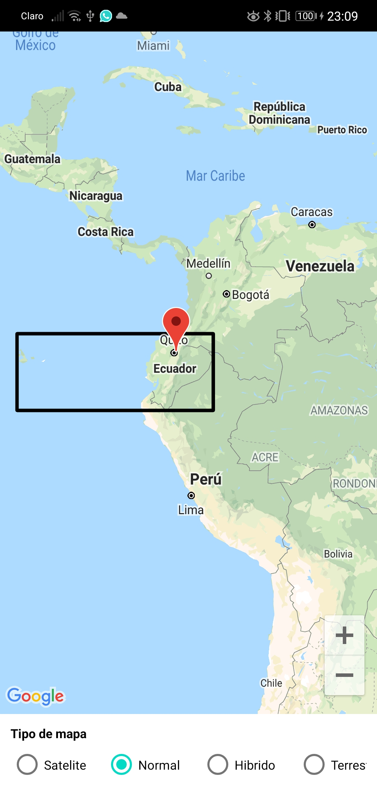

# firebase-ml-y-google-maps
evaluación parcial: desarrollo de una aplicación móvil usando las api de firebase ml y Google Maps
el usuario tiene la opción de abrir una imagen de galería o abrir la cámara 
cuando se abre la aplicación aparece lo siguiente: 
 
Reconoce el Texto: 
 

polígono: 
 
bandera de ecuador: 
 

bandera de perú: 
 
